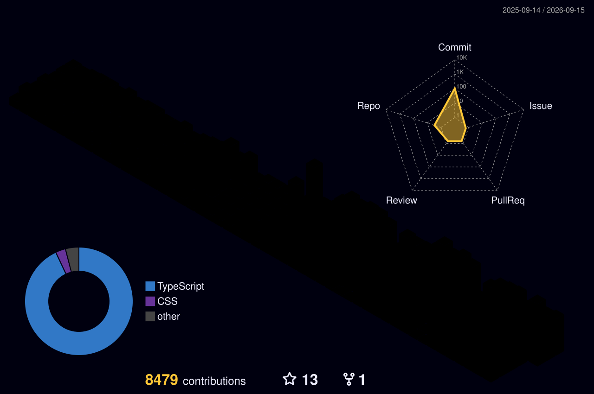

  

----
<h1 align="left">Hey Folks  I'm Wagner</h1>

- 👨‍💻 **Senior Software Engineer**  
- 🎯 **Passionate about clean and scalable code**  
- 📚 **Always learning and improving**  
- 📍 **Based in Brazil, but dreaming of working internationally**  
- ⚛ Specializing in **React Native**, **Golang**, **ReactJS**, **TypeScript**, **Node.js**  
- 🔥 Strong experience with **GraphQL**, and **AWS**, **Java**, **Spring** and **Golang**
- 💬 Open to networking! Connect with me on **[LinkedIn](https://www.linkedin.com/in/wagaodev)**  
- 🫡 My friends call me "**Wagão**"  
- 🏡 Father of **Antonella**, my beautiful autistic child  
- ❤️ **My wife is also a developer**! Visit her profile:  
  
  

---

##
   

     
  

## 🛠 Tech Stack  

  
   

---

## 🔗 Connect with me  

  
  

